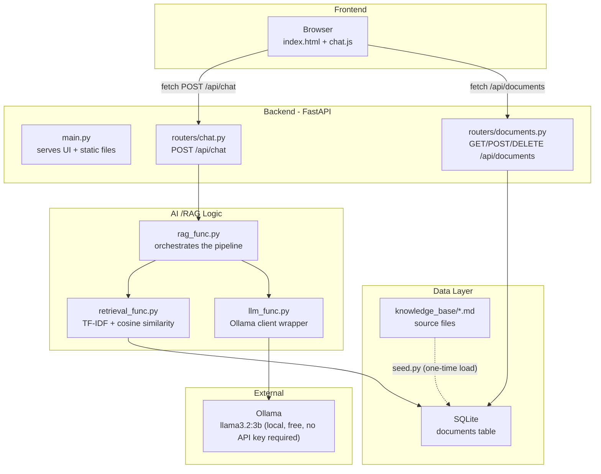

# AI Knowledge Assitant

A RAG-based (Retrieval-Augmented Generation) chat assistant that answers employee questions using a small company knowledge 
base (KB).

Ask it questions like *"How do i reset my password?"* or *"How many WFH days do interns get?"* and it will answer using only 
the information in the KB - with sources shown, and an honest answer when there is no relevant information for the question asked by the user.

---

## 1. Project Overview

The system allows the user to ask a question in a chat interface. The abckend retrieves 3 most relevant document (top_k = 3) from a small company KB (employee onboarding, expense claim, laptop replacement, leave application, office wifi, password reset, vpm troubleshooting and wfh policy), constructus a ground prompt, and asks a locally running LLM (via [Ollama] (https://ollama.com)) to answer using only that retreived content. The answer and its source documents are returned as the output to the user.

KB documents can also be managed directly via REST API (create, list, delete)

---

## 2. Architecture



**Separation of Concerns**
- **Frontend** (`frontend/`) - plain HTML,CSS,JS, talks to the backend only via `fetch()` calls to the REST API. No business logic lives in this directory
- **Backend** (`backend/app/routers/`) - FastAPI route handlers. They validate input via Pydantic and delegate to services.
- **AI / RAG logic** (`backend/app/services`) - retrieval, prompt reconstruction, and the LLM call are isolated here, independent of HTTP concerns. This is what makes the automated tests run without the LLM.
- **Data Layer** (`backend/app/database.py`, `models.py`, SQLite file) - persistent, independent of both the API and the AI logic.

---

## 3. Technology choices

| Layer | Choice | Why |
|---|---|---|
|Backend framework| **FastAPI** | Async-capable, built-in request validation via Pydantic, automatic interactive API docs (`/docs`), minimal boilerplate. |
| Frontend | **Plain HTML, CSS, JS + Jinja2** | The UI requirement is a single chat page - a full JS framework (React/Vue) would add a second toolchain which provide no real benefit at this scale, while still preserving a clean frontend/backend boundary. |
| Database | **SQLite** | Zero setup - no server to install or configure. A reviewer can clone the repo and run it directly. Swappable with PostgreSQL/MySQL later with almost no code change, as access goes through SQLAlchemy's ORM. |
| Retrieval | **TF-IDF + cosine similarity** | Fully offline, no model download, no external dependency required. TF-IDF is explicitly listed as an acceptable approach in the requirements. Trade-offs will be documented under Known Limitation section. |
| LLM | **Ollama, running llama3.2:3b locally** | Free, API key-free, no billing, no network dependency once the model is pulled. Chosen over cloud provider (Gemini, OpenAI) specifically to eliminate any cost or key-management concern. |
| Testing | **pytest + FastAPI's TestClient** | Standard for this stack; TestClient lets tests exercise the real HTTP layer without a running server. |

---

## 4. Setup Instructions

### Prerequisites
- Python 3.11+
- [Ollama](https://ollama.com/download) installed

### Steps

```bash
# 1. Clone the repo
git clone https://github.com/Ryan-Leong13/ai-knowledge-assistance.git
cd ai-knowledge-assistance

# 2. Create and activate virtual environment
python -m venv venv
source venv/bin/activate        # Windows: source venv\Scripts\activate

# 3. Install dependencies
pip install -r requirements.txt

# 4. Set up environment variables
cp .env.examples .env           # Windows: copy .env.example .env

# 5. Pull the local LLM model (one-time only, ~2GB download)
ollama pull llama3.2:3b

# 6. Seed the database with the KB documents
# Eventhough there is existing .db file in the current folder, seeding once more will not duplicate the data
python -m backend.app.seed

# 7. Run the app (Detailed in Section 6)
```

---

## 5. Environment Variables 

Defined in `.env` (copy from `.env.example`):

| Variable | Default | Purpose |
|---|---|---|
| `LLM Model` | `llama 3.2:3b` | Which Ollama model to use |
| `OLLAMA_BASE_URL` | `http://localhost:11434` | Where the local Ollama server is listening |  
| `DATABASE_URL` | `sqlite:///./backend/app/data/knowledge_base.db` | SQLAlchemy connection string |
| `TOP_K` | `3` | Number of documents retrieved per query |
| `SIMILARITY_THRESHOLD` | `0.05` | Minimum top-match score before calling the LLM at all (Detailed in Section 10) |
| `LOG_LEVEL` | `INFO` | Logging verbosity |

No API keys are required anywhere in this project.

---

## 6. How to Run the Frontend

The frontend is served **by the same FastAPI app** as the backend — there is no separate frontend server or build step.

```bash
uvicorn backend.app.main:app --reload
```

Then open **http://127.0.0.1:8000/** in any browser.

---

## 7. How to Run the Backend

Same command as above runs both:

```bash
uvicorn backend.app.main:app --reload
```

- Chat UI: http://127.0.0.1:8000/
- Interactive API docs (Swagger UI): http://127.0.0.1:8000/docs
- Health check: http://127.0.0.1:8000/health

Make sure Ollama is running in the background (it typically starts automatically after installation; otherwise run `ollama serve` in a separate terminal).

---

## 8. How to Run Tests

```bash
pytest
```

Expected output: `13 passed`.

Tests used an isolated, temporary SQLite database (created and destroyed per test) and a fully mocked LLM — **no Ollama connection or real database is touched**, so the suite runs in under a second and never costs anything or depends on external state.

---

## 9. API Documentation

Full interactive documentation is auto-generated at `/docs` (Swagger UI) once the server is running. Summary:

### `POST /api/chat`
**Request:**
```json
{ "message": "How do I reset my password?" }
```
**Response (200):**
```json
{
  "answer": "You can reset your password via the Identity Portal...",
  "sources": [
    { "title": "Password Reset", "content": "..." }
  ]
}
```
**Errors:** `422` on empty/missing `message`. `502` if the LLM (Ollama) is unreachable.

### `GET /api/documents`
Returns all documents. `200` with a JSON array (empty array if none).

### `POST /api/documents`
**Request:** `{ "title": "...", "content": "..." }`
**Response:** `201` with the created document. `422` on missing/empty fields.
Note: newly created documents are retrievable immediately, since retrieval re-fits over the full corpus on every query (see Section 10).

### `DELETE /api/documents/{document_id}`
`204` on success. `404` if the document doesn't exist.

### `GET /health`
Simple liveness check, returns `{"status": "ok"}`.

---

## 10. RAG Implementation

1. **Storage** — Each KB document is a row in a SQLite `documents` table (`id`, `title`, `content`, timestamps), loaded from the `.md` files in `backend/app/data/knowledge_base/` via `seed.py`.
2. **Retrieval** — `retrieval_func.py` fits a `TfidfVectorizer` over the full set of document contents plus the user's query together, then ranks documents by cosine similarity to the query. This is done fresh on every request rather than using pre-computed stored vectors (Detailed in Section 11).
3. **Context selection** — the top `TOP_K` (default 3) highest-scoring documents are selected.
4. **Prompt construction** — `rag_func.py` builds a prompt containing the retrieved documents as context, with explicit instructions telling the LLM to answer only from that context and to say plainly if the answer isn't there.
5. **LLM call** — the prompt is sent to a local Ollama model (`llm_func.py`).
6. **Answer + sources** — the generated answer is returned to the user alongside the title and content of every document used as context, so the user can verify the answer's basis.

### Hallucination / unknown-question handling
This is handled in **two layers**, because retrieval score alone can't reliably tell "wrong topic" apart from "right topic, missing detail":

1. **Similarity threshold (cheap, deterministic)** — if the top retrieval score is at or near zero (the query shares essentially no vocabulary with anything in the KB — e.g. *"What's the weather today?"*), the LLM is never called at all. The API returns a fixed message immediately: *"I couldn't find information about that in the knowledge base..."*
2. **Prompt-level grounding (for everything else)** — for a query like *"What is the maternity leave policy?"*, TF-IDF still retrieves the "Leave Application" document, because it shares vocabulary ("leave", "policy") — but that document only covers annual/sick/compassionate leave. The prompt explicitly instructs the LLM: *"If the context does not contain the answer, say plainly that the information could not be found... Do NOT guess, assume, or invent."* Verified manually against Ollama and covered by an automated test (`tests/test_chat.py`) that inspects the actual prompt sent to confirm these instructions are present.

Both paths were tested manually against the real local LLM during development and behaved correctly.

---

## 11. Known Limitations

- **TF-IDF retrieval re-fits on every query.** This is fine for a KB of ~8–50 documents but would not scale efficiently to thousands of documents — a production system would use pre-computed embeddings (e.g. `sentence-transformers` + a vector store like Chroma) instead. This was in fact the original plan; it was changed during development after the embedding model failed to download in a network-restricted environment. See `AI_USAGE.md` for a more detailed explanation.
- **TF-IDF is vocabulary-based, not semantic.** It cannot distinguish "maternity leave" from "annual leave" by meaning — only the LLM's prompt-level grounding catches this class of error (see Section 10).
- **No authentication.** Anyone with network access to the server can use the chat and document management endpoints. Fine for a local take-home assessment; would need auth for any real deployment.
- **Chat is stateless / no conversation memory.** Each message is answered independently; the LLM doesn't see prior turns in the conversation. Follow-up questions work as new independent queries, not as a continued dialogue.
- **Logging includes raw user message text.** Acceptable for this scope; a production system handling sensitive employee questions would want a log retention/redaction policy.
- **Single local LLM, no fallback.** If Ollama isn't running, chat requests fail with a `502`. There's no fallback provider.

---

## 12. Potential Future Improvements

- Swap TF-IDF for a proper embedding-based vector store (e.g. Chroma + `sentence-transformers`) with embeddings computed once at document-creation time instead of per-query, for better semantic matching and scalability.
- Add conversation memory so follow-up questions can reference earlier turns.
- Add authentication and per-user access control.
- Add a document-management UI (currently API-only, per the assessment brief's minimum requirement).
- Support file uploads (PDF/DOCX) for the knowledge base instead of requiring pre-formatted Markdown.
- Add response streaming so answers appear token-by-token instead of all at once.
- Add basic rate limiting on `/api/chat` to protect the LLM from abuse if ever deployed beyond local use.
